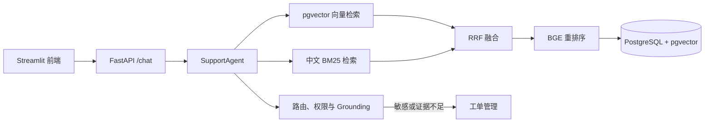

# 智行科技内部员工助手

面向中文互联网科技公司的内部支持演示系统。系统使用 BGE-M3 与 PostgreSQL pgvector 检索差旅、办公 IT 和账号权限知识；普通问题返回带来源的答案，敏感操作自动创建工单，不执行密码重置或权限变更。

## 项目定位

这是一个可落地的中文企业知识库 Agent：员工提问后，系统先进行敏感操作识别、权限与来源校验，再通过三层混合检索定位企业知识；对于敏感请求或证据不足的请求，系统自动创建可追踪的支持工单。



## 项目结构

```text
app/
├─ api/          # FastAPI 接口、限流、请求与响应模型
├─ core/         # 环境变量与实验 YAML 配置
├─ db/           # SQLAlchemy 模型与数据库会话
├─ ingestion/    # Markdown 切块、Embedding 与知识库入库
├─ retrieval/    # 向量、BM25、RRF 与重排序三层检索
├─ support/      # Agent 编排、安全路由、Grounding 与工单服务
├─ evaluation/   # 黄金数据集、指标与实验运行器
└─ ui/           # Streamlit 员工问答页、工单管理页与主题

data/            # 演示文档与评测黄金集
configs/         # V1~V4 实验配置（含 RRF、三层重排序）
tests/           # api、检索、业务、安全、评估与 UI 自动化测试
alembic/         # PostgreSQL / pgvector 数据库迁移与索引
scripts/         # 演示数据初始化、评估与 Docker 启动脚本
```

### 核心模块

- `app/api/main.py`：应用入口，提供 `/health`、`/chat`、Trace 与工单接口；应用启动时完成配置校验与模型预热。
- `app/support/agent.py`：全链路编排器，负责调用检索、执行安全决策、生成引用、创建工单及写入查询 Trace。
- `app/retrieval/service.py`：三层检索主流程，记录 embedding、向量、BM25、融合、重排等分段耗时。
- `app/retrieval/bm25.py`：面向中文文本的 BM25 词法检索。
- `app/retrieval/reranker.py`：使用 `BAAI/bge-reranker-v2-m3` 对融合候选进行交叉编码器重排序；模型不可用时安全降级到 RRF。
- `app/ingestion/service.py`：格式分发 Markdown 与 PDF，将文档切块、生成 BGE-M3 向量并写入 pgvector，返回入库汇总。
- `app/ingestion/pdf.py`：PyMuPDF 逐页提取可选文本、pdfplumber 提取简单原生表格；加密、损坏或不可提取的文件只返回报告，不阻断其余文档。
- `app/support/routing.py`、`grounding.py`：拦截密码、权限、数据等敏感请求，完成访问级别过滤与回答来源验证。
- `app/ui/streamlit_app.py`：员工问答工作台；`app/ui/ticket_management.py`：管理员工单工作台。

### 请求链路

`Streamlit 页面 → FastAPI /chat → SupportAgent → 安全路由 → 三层检索 → 带引用回答 / 创建工单 → 写入 QueryTrace`

## 启动顺序

### 检索模型下载与降级

首次启动 API 时会下载 BGE-M3 向量模型和 BGE Cross-Encoder 重排序模型。请在启动前设置 Hugging Face 端点（PowerShell）：

```powershell
$env:HF_ENDPOINT = "https://huggingface.co"
```

模型下载完成后，服务会复用本地缓存。若重排序模型不可用（例如网络不可达或模型文件缺失），检索不会阻止服务启动，而会安全降级为仅使用 RRF 融合排序的结果。

### DeepSeek 生成与流式回答

普通知识库问题会先完成安全路由与三层混合检索，再调用 DeepSeek 生成中文回答；页面通过 `/chat/stream` 分段显示已验证来源编号的内容。敏感请求、无可用证据、模型调用失败或回答缺少有效来源编号时，不会调用或不会采用模型回答，而是自动创建支持工单。

在 API 启动窗口设置 DeepSeek 密钥（PowerShell）：

```powershell
$env:LLM_API_KEY = "sk-你的-DeepSeek-API-Key"
$env:LLM_BASE_URL = "https://api.deepseek.com"
$env:LLM_MODEL = "deepseek-v4-flash"
```

也可以将相同配置写入项目根目录的 `.env`。请勿将真实密钥提交到 Git；Streamlit 只请求本地 FastAPI，浏览器不会接触 DeepSeek API Key。

首次启动或重新写入演示知识库时，在项目目录依次运行：

```powershell
docker compose up -d db
uv run alembic upgrade head
uv run python scripts/seed_demo.py --clear
uv run uvicorn app.api.main:app --host 0.0.0.0 --port 8000 --reload
```

另开一个 PowerShell 窗口：

```powershell
uv run streamlit run app/ui/streamlit_app.py --server.port 8501
```

浏览器打开 `http://localhost:8501`。数据库 Docker 卷未删除时，后续重启只需启动数据库、API 和 Streamlit。

### 管理工单

另开一个 PowerShell 窗口运行：

```powershell
uv run streamlit run app/ui/ticket_management.py --server.port 8502
```

浏览器打开 `http://localhost:8502`，输入 API 地址和与 API 服务 `ADMIN_TOKEN` 一致的管理员令牌。管理页可以按状态、风险等级筛选工单，并将工单更新为“处理中”或“已解决”。

## 中文演示问题

- `差旅报销应在多久内提交？`
- `国内出差住宿每晚报销上限是多少？`
- `请帮我重置 VPN 密码`
- `帮我开通生产环境管理员权限`

## 本地评测与实验结论

项目内置 14 条中文企业支持评测集，覆盖知识问答、敏感请求路由与引用检索。运行实验：

```powershell
uv run python scripts/run_evaluation.py --version v4-rrf
uv run python scripts/run_evaluation.py --version v4-rerank
```

已有本地实验产物显示：

| 实验版本 | 检索策略 | 文档召回率 | 工单路由 F1 | 不安全自信回答率 | P50 / P95 延迟 |
| --- | --- | ---: | ---: | ---: | ---: |
| v4-rrf | 向量 + 中文 BM25 + RRF | 83.33% | 85.71% | 7.14% | 123 / 183 ms |
| v4-rerank | 三阶段检索 + Cross-Encoder 重排序 | 83.33% | 85.71% | 7.14% | 2590 / 10470 ms |

在当前小样本中，重排序没有带来直接召回增益，却显著增加尾延迟；因此后续应扩大评测集，并使用 MRR、nDCG 与人工相关性标注继续验证其收益。这些结果仅代表项目内置演示评测，不代表生产环境指标。

## PDF 与表格知识入库

`ingest_documents` 按名称顺序分发 `data/documents` 下的 Markdown 与 PDF：Markdown 走标题切块，PDF 严格以页为边界——PyMuPDF 提取正文文本，pdfplumber 提取行/列规整、总单元格不超过 500 的简单原生表格，并序列化为可检索的 Markdown 表格与原始 JSON。来源类型、文件路径、页码、表格名与表格 JSON 贯穿分块、持久化、检索结果与 API 引用，回答引用会标注 `第 N 页` 或 `第 N 页，表格 M`。

扫描件、截图、图表以及复杂/合并单元格表格无法被文本提取，会被报告为跳过（SKIPPED），需要后续 OCR / 视觉版本处理。

```powershell
uv run alembic upgrade head
uv run python scripts/seed_demo.py --clear
```

入库输出包含确定性的统计：总 chunks、Markdown 文档数、PDF 文档数、PDF 正文 chunk 总数、表格 chunk 总数，以及对每个非成功 PDF 的 `SKIPPED: <path> (<status>)` 提示。

## 质量门禁

```powershell
uv run ruff check .
uv run pytest -m "not integration" -v
```

## 已知限制

- 普通回答依赖已配置的 DeepSeek API；模型不可用时会安全降级为创建支持工单，而不会编造答案。
- 权限映射为演示实现，真实企业应接入 SSO/OIDC。
- 演示制度和数据均为虚构内容。
